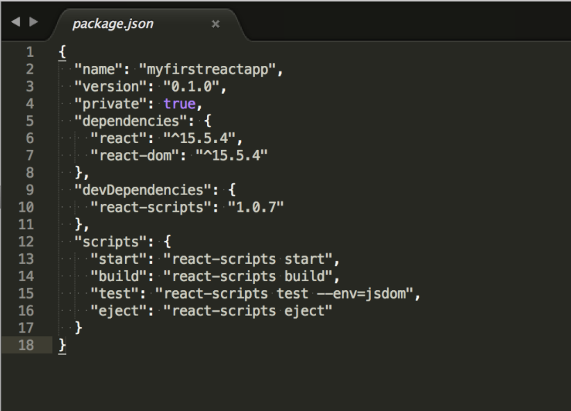
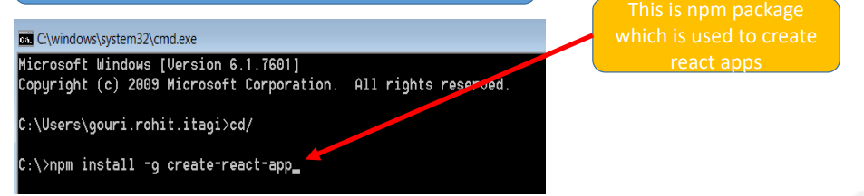
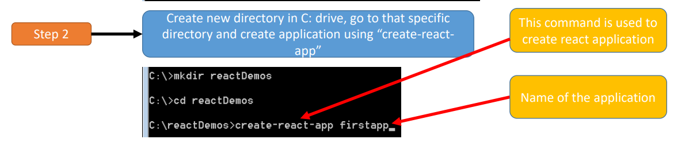
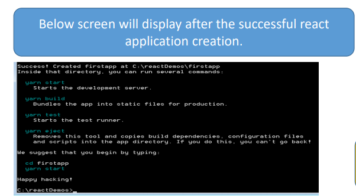
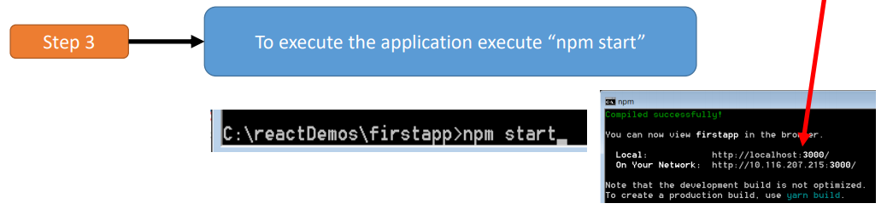

<html>
<body>
<h1>What Is React?</h1>

React is a declarative, efficient, and flexible JavaScript library for building user interfaces. It lets you compose complex UIs from small and isolated pieces of code called “components”.

<h2>Installing React js using Node Package Manager</h2>

You can install npm by installing Node.js. Node.js is an environment for developing server-side applications. When you install Node.js, npm will install automatically.

<ol>
<li><a href="https://nodejs.org/en/">click here </a>to navigate to the Node.js homepage in a new tab.</li>

<li>You should see links to download Node.js. Click on the download link of your choice. Follow the subsequent instructions to install Node.js and npm. If you’ve already installed Node.js, that’s okay, do it anyway.</li>
</ol>
<h3> Once you’ve done all that, type below command into your terminal:</h3>
<ul>
    <li>Type npm init in your command prompt: It will ask lot of questions regarding project and then it will create a package.json file </li>
    
  

<li>Type npm install create-react-app command in command prompt </li>

    <li> Next Create new directory and create application using create-react-app command</li>
    
    <li>Below diagram show successful project creation</li>
    
    <li> To execute application execute npm start command it will start server</li>
    
</ul>
<h3>References</h3>
<ul>
    <li><a href="https://www.tutorialspoint.com/reactjs/reactjs_environment_setup.htm#">Tutorial Point React Installation</a></li>

     <li><a href="https://reactjs.org/tutorial/tutorial.html#setup-for-the-tutorial">React Tutorial</a></li>
     <li>;</li>
</ul>

</body>
</html>